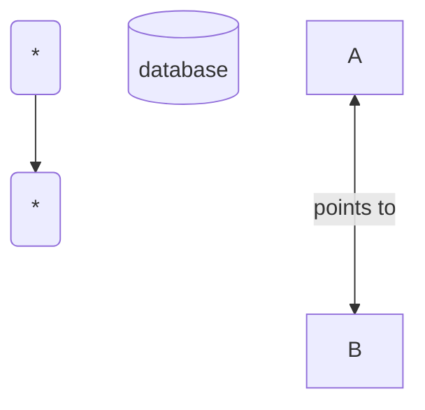
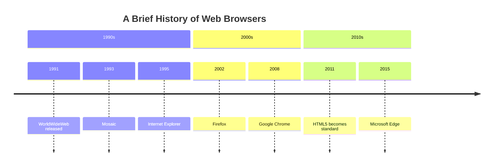
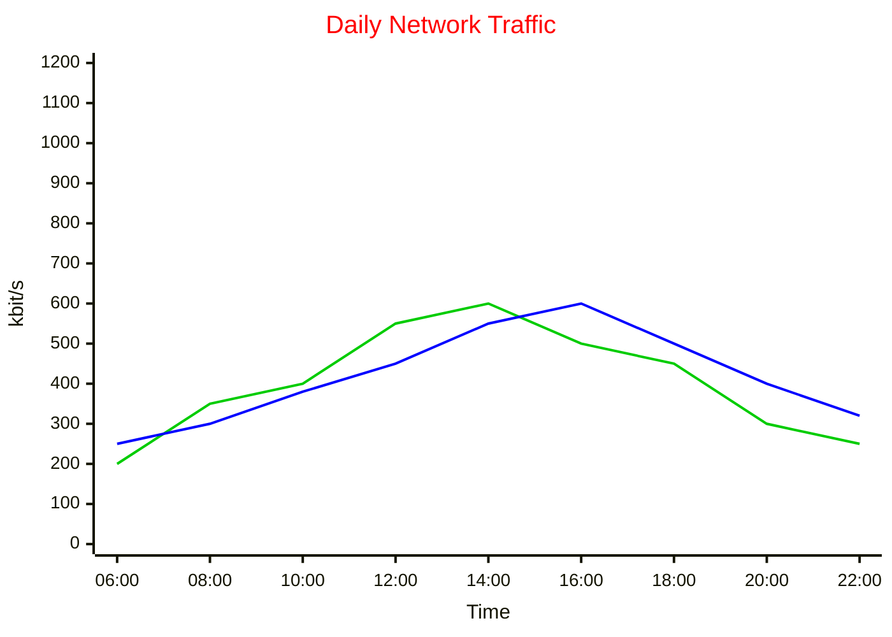

# test

```mermaid
flowchart TD
   A <--->|points to| B
   C[(database)]
   D(*) --> DE(*)
```

```mermaid
timeline
    title A Brief History of Web Browsers
    section 1990s
        1991 : WorldWideWeb released
        1993 : Mosaic
        1995 : Internet Explorer
    section 2000s
        2002 : Firefox
        2008 : Google Chrome
    section 2010s
        2011 : HTML5 becomes standard
        2015 : Microsoft Edge
```

```mermaid
xychart-beta
    title "Sales Revenue"
    x-axis [0, 1, 2, 3, 4, 5, 6, 7, 8, 9, 10, 11, 12, 13, 14, 15, 16, 17, 18, 19, 20, 21, 22, 23, 24, 25, 26, 27, 28, 29, 30, 31, 32, 33, 34, 35, 36, 37, 38, 39, 40, 41, 42, 43, 44, 45, 46, 47, 48, 49, 50, 51, 52, 53, 54, 55, 56, 57, 58, 59, 60, 61, 62, 63, 64, 65, 66, 67, 68, 69, 70, 71, 72, 73, 74, 75, 76, 77, 78, 79, 80, 81, 82, 83, 84, 85, 86, 87, 88, 89, 90, 91, 92, 93, 94, 95, 96, 97, 98, 99, 100, 101, 102, 103, 104, 105, 106, 107, 108, 109, 110, 111, 112, 113, 114, 115, 116, 117, 118, 119, 120, 121, 122, 123, 124, 125, 126, 127, 128, 129, 130, 131, 132, 133, 134, 135, 136, 137, 138, 139, 140, 141, 142, 143, 144, 145, 146, 147, 148, 149, 150, 151, 152, 153, 154, 155, 156, 157, 158, 159, 160, 161, 162, 163, 164, 165, 166, 167, 168, 169, 170, 171, 172, 173, 174, 175, 176, 177, 178, 179, 180, 181, 182, 183, 184, 185, 186, 187, 188, 189, 190, 191, 192, 193, 194, 195, 196, 197, 198, 199, 200, 201, 202, 203, 204, 205, 206, 207, 208, 209, 210, 211, 212, 213, 214, 215, 216, 217, 218, 219, 220, 221, 222, 223, 224, 225, 226, 227, 228, 229, 230, 231, 232, 233, 234, 235, 236, 237, 238, 239, 240, 241, 242, 243, 244, 245, 246, 247, 248, 249, 250, 251, 252, 253, 254, 255, 256, 257, 258, 259, 260, 261, 262, 263, 264, 265, 266, 267, 268, 269, 270, 271, 272, 273, 274, 275, 276, 277, 278, 279, 280, 281, 282, 283, 284, 285, 286, 287, 288, 289, 290, 291, 292, 293, 294, 295, 296, 297, 298, 299, 300, 301, 302, 303, 304, 305, 306, 307, 308, 309, 310, 311, 312, 313, 314, 315, 316, 317, 318, 319, 320, 321, 322, 323, 324, 325, 326, 327, 328, 329, 330, 331, 332, 333, 334, 335, 336, 337, 338, 339, 340, 341, 342, 343, 344, 345, 346, 347, 348, 349, 350, 351, 352, 353, 354, 355, 356, 357, 358, 359, 360, 361, 362, 363, 364, 365, 366, 367, 368, 369, 370, 371, 372, 373, 374, 375, 376, 377, 378, 379, 380, 381, 382, 383, 384, 385, 386, 387, 388, 389, 390, 391, 392, 393, 394, 395, 396, 397, 398, 399, 400, 401, 402, 403, 404, 405, 406, 407, 408, 409, 410, 411, 412, 413, 414, 415, 416, 417, 418, 419, 420, 421, 422, 423, 424, 425, 426, 427, 428, 429, 430, 431, 432, 433, 434, 435, 436, 437, 438, 439, 440, 441, 442, 443, 444, 445, 446, 447, 448, 449, 450, 451, 452, 453, 454, 455, 456, 457, 458, 459, 460, 461, 462, 463, 464, 465, 466, 467, 468, 469, 470, 471, 472, 473, 474, 475, 476, 477, 478, 479, 480, 481, 482, 483, 484, 485, 486, 487, 488, 489, 490, 491, 492, 493, 494, 495, 496, 497, 498, 499, 500, 501, 502, 503, 504, 505, 506, 507, 508, 509, 510, 511, 512, 513, 514, 515, 516, 517, 518, 519, 520, 521, 522, 523, 524, 525, 526, 527, 528, 529, 530, 531, 532, 533, 534, 535, 536, 537, 538, 539, 540, 541, 542, 543, 544, 545, 546, 547, 548, 549, 550, 551, 552, 553, 554, 555, 556, 557, 558, 559, 560, 561, 562, 563, 564, 565, 566, 567, 568, 569, 570, 571, 572, 573, 574, 575, 576, 577, 578, 579, 580, 581, 582, 583, 584, 585, 586, 587, 588, 589, 590, 591, 592, 593, 594, 595, 596, 597, 598, 599, 600, 601, 602, 603, 604, 605, 606, 607, 608, 609, 610, 611, 612, 613, 614, 615, 616, 617, 618, 619, 620, 621, 622, 623, 624, 625, 626, 627, 628, 629, 630, 631, 632, 633, 634, 635, 636, 637, 638, 639, 640, 641, 642, 643, 644, 645, 646, 647, 648, 649, 650, 651, 652, 653, 654, 655, 656, 657, 658, 659, 660, 661, 662, 663, 664, 665, 666, 667, 668, 669, 670, 671, 672, 673, 674, 675, 676, 677, 678, 679, 680, 681, 682, 683, 684, 685, 686, 687, 688, 689, 690, 691, 692, 693, 694, 695, 696, 697, 698, 699, 700, 701, 702, 703, 704, 705, 706, 707, 708, 709, 710, 711, 712, 713, 714, 715, 716, 717, 718, 719, 720, 721, 722, 723, 724, 725, 726, 727, 728, 729, 730, 731, 732, 733, 734, 735, 736, 737, 738, 739, 740, 741, 742, 743, 744, 745, 746, 747, 748, 749, 750, 751, 752, 753, 754, 755, 756, 757, 758, 759, 760, 761, 762, 763, 764, 765, 766, 767, 768, 769, 770, 771, 772, 773, 774, 775, 776, 777, 778, 779, 780, 781, 782, 783, 784, 785, 786, 787, 788, 789, 790, 791, 792, 793, 794, 795, 796, 797, 798, 799, 800, 801, 802, 803, 804, 805, 806, 807, 808, 809, 810, 811, 812, 813, 814, 815, 816, 817, 818, 819, 820, 821, 822, 823, 824, 825, 826, 827, 828, 829, 830, 831, 832, 833, 834, 835, 836, 837, 838, 839, 840, 841, 842, 843, 844, 845, 846, 847, 848, 849, 850, 851, 852, 853, 854, 855, 856, 857, 858, 859, 860, 861, 862, 863, 864, 865, 866, 867, 868, 869, 870, 871, 872, 873, 874, 875, 876, 877, 878, 879, 880, 881, 882, 883, 884, 885, 886, 887, 888, 889, 890, 891, 892, 893, 894, 895, 896, 897, 898, 899, 900, 901, 902, 903, 904, 905, 906, 907, 908, 909, 910, 911, 912, 913, 914, 915, 916, 917, 918, 919, 920, 921, 922, 923, 924, 925, 926, 927, 928, 929, 930, 931, 932, 933, 934, 935, 936, 937, 938, 939, 940, 941, 942, 943, 944, 945, 946, 947, 948, 949, 950, 951, 952, 953, 954, 955, 956, 957, 958, 959, 960, 961, 962, 963, 964, 965, 966, 967, 968, 969, 970, 971, 972, 973, 974, 975, 976, 977, 978, 979, 980, 981, 982, 983, 984, 985, 986, 987, 988, 989, 990, 991, 992, 993, 994, 995, 996, 997, 998, 999]
    line [0, 1, 2, 0, 3, 5, 2, 3, 8, 8, 2, 3, 7, 2, 10, 2, 6, 12, 2, 1, 18, 10, 8, 7, 4, 5, 7, 0, 27, 2, 23, 5, 30, 1, 30, 1, 8, 3, 12, 36, 37, 38, 30, 43, 42, 11, 31, 38, 48, 39, 15, 23, 3, 23, 50, 25, 1, 0, 34, 59, 32, 24, 26, 40, 10, 7, 28, 29, 4, 8, 25, 48, 65, 18, 19, 36, 7, 59, 3, 44, 28, 28, 37, 37, 76, 60, 52, 81, 34, 1, 67, 6, 23, 46, 19, 63, 49, 40, 66, 15, 27, 13, 70, 99, 10, 27, 59, 64, 51, 30, 52, 58, 80, 72, 4, 49, 30, 44, 15, 54, 51, 76, 10, 0, 49, 74, 75, 107, 97, 34, 104, 58, 60, 110, 115, 126, 112, 120, 26, 54, 98, 64, 70, 122, 126, 113, 116, 138, 135, 38, 10, 12, 107, 125, 48, 133, 54, 40, 64, 84, 53, 84, 111, 134, 121, 9, 28, 11, 154, 135, 122, 28, 102, 171, 48, 97, 123, 24, 143, 150, 73, 47, 86, 134, 43, 132, 184, 55, 120, 177, 182, 48, 128, 173, 124, 188, 3, 191, 32, 118, 28, 132, 26, 182, 13, 125, 33, 95, 11, 123, 177, 148, 31, 154, 55, 79, 209, 200, 176, 47, 51, 176, 192, 54, 165, 134, 183, 145, 171, 150, 158, 47, 46, 99, 231, 73, 62, 104, 216, 208, 16, 50, 72, 82, 59, 180, 127, 245, 234, 83, 186, 80, 190, 82, 19, 122, 55, 126, 6, 112, 137, 25, 226, 19, 35, 163, 248, 158, 103, 196, 96, 231, 131, 239, 172, 47, 140, 211, 274, 237, 109, 266, 245, 111, 191, 55, 174, 6, 65, 122, 154, 52, 84, 82, 155, 259, 7, 37, 200, 247, 293, 132, 228, 17, 157, 15, 231, 275, 37, 103, 65, 80, 130, 95, 226, 83, 182, 20, 255, 14, 254, 114, 249, 150, 108, 145, 270, 212, 123, 61, 68, 145, 309, 58, 138, 142, 124, 248, 70, 267, 90, 99, 207, 316, 103, 226, 24, 267, 227, 4, 115, 67, 139, 186, 33, 92, 140, 274, 12, 9, 259, 261, 2, 127, 245, 132, 90, 335, 141, 196, 356, 44, 369, 312, 300, 5, 183, 164, 195, 206, 0, 13, 268, 231, 121, 306, 318, 192, 379, 351, 255, 299, 201, 327, 275, 4, 238, 179, 297, 171, 155, 160, 333, 63, 203, 242, 162, 361, 271, 208, 34, 7, 140, 45, 55, 208, 58, 110, 345, 48, 413, 349, 285, 159, 229, 131, 228, 194, 249, 295, 236, 230, 256, 242, 131, 67, 337, 306, 402, 215, 5, 402, 137, 270, 342, 56, 133, 43, 89, 244, 229, 92, 405, 185, 283, 58, 421, 14, 55, 150, 415, 296, 178, 377, 126, 254, 373, 411, 427, 369, 207, 36, 44, 229, 276, 448, 164, 275, 90, 355, 297, 411, 415, 72, 10, 1, 107, 152, 6, 194, 221, 327, 465, 149, 346, 51, 138, 151, 291, 429, 489, 304, 281, 135, 385, 158, 45, 124, 422, 107, 250, 65, 62, 284, 399, 142, 25, 300, 50, 476, 1, 167, 309, 380, 214, 246, 291, 182, 346, 336, 307, 530, 294, 289, 219, 271, 521, 127, 378, 406, 411, 500, 304, 220, 190, 54, 158, 208, 455, 509, 541, 80, 175, 248, 459, 228, 349, 537, 537, 10, 461, 110, 506, 11, 456, 352, 282, 259, 214, 441, 443, 5, 147, 266, 509, 245, 469, 10, 560, 265, 163, 202, 567, 73, 14, 292, 160, 78, 532, 488, 101, 244, 286, 437, 90, 160, 36, 364, 13, 260, 151, 423, 229, 580, 49, 548, 21, 507, 493, 222, 589, 319, 125, 364, 0, 446, 145, 538, 382, 476, 80, 73, 563, 428, 168, 320, 368, 417, 467, 53, 23, 529, 174, 317, 349, 561, 396, 297, 55, 426, 222, 314, 85, 10, 347, 282, 629, 644, 214, 337, 231, 141, 608, 409, 447, 83, 16, 31, 176, 585, 646, 497, 261, 238, 468, 361, 227, 297, 175, 532, 285, 325, 163, 245, 411, 199, 573, 32, 261, 255, 675, 247, 414, 531, 624, 431, 410, 579, 266, 18, 405, 303, 471, 135, 516, 581, 344, 340, 640, 383, 192, 547, 189, 176, 31, 56, 508, 291, 132, 496, 573, 611, 534, 169, 282, 219, 489, 428, 511, 414, 114, 173, 59, 297, 180, 441, 685, 690, 155, 287, 27, 442, 285, 669, 674, 161, 407, 68, 251, 627, 334, 134, 657, 24, 39, 387, 575, 603, 496, 742, 394, 537, 94, 540, 362, 466, 594, 595, 571, 568, 297, 98, 304, 484, 549, 299, 541, 360, 546, 95, 117, 276, 322, 659, 741, 627, 184, 428, 237, 265, 249, 61, 778, 254, 153, 294, 578, 392, 751, 552, 552, 145, 664, 292, 18, 248, 250, 79, 676, 613, 605, 43, 293, 565, 736, 352, 432, 502, 152, 267, 623, 481, 353, 677, 681, 421, 413, 211, 88, 715, 814, 460, 478, 182, 433, 528, 825, 376, 94, 407, 68, 128, 232, 559, 565, 154, 745, 721, 212, 434, 108, 209, 153, 385, 841, 482, 459, 620, 641, 717, 40, 549, 611, 445, 385, 709, 697, 107, 792, 798, 10, 213, 26, 438, 237, 86, 406, 181, 152, 268, 129, 386, 137, 1, 685, 855, 628, 379, 588, 43, 828, 152, 281, 515, 465, 308, 314, 706, 77, 57, 117, 109, 780, 276, 116, 650, 625, 773, 742, 257, 148, 147, 612, 492, 288, 306, 414, 494, 478, 536, 25, 130, 890, 901, 108, 474, 888, 314, 300, 401, 247, 625, 384, 794, 39, 677, 795, 146, 13, 636, 239, 22, 284, 789, 788, 905, 49, 50, 333, 772, 259, 399, 214, 412, 895, 478, 752, 819, 941, 341, 361, 793, 501, 791, 666, 858, 902, 825, 829, 370, 32, 880, 722, 202, 709, 219, 433, 528, 413, 411, 501, 187, 678, 635, 138, 725, 946, 551, 18, 653, 527, 834, 520, 221, 250, 511, 937, 173, 2, 816, 108, 780, 52, 218, 746, 258, 602, 487, 381, 71]
```

```mermaid
---
config:
  themeVariables:
    xyChart:
      plotColorPalette: "#00cc00, #0000ff"
      width: 900
      height: 600
      showDataLabel: true
      titleColor: "#ff0000"
---
xychart-beta
    title "Daily Network Traffic"
    x-axis "Time" ["06:00", "08:00", "10:00", "12:00", "14:00", "16:00", "18:00", "20:00", "22:00"]
    y-axis "kbit/s" 0 --> 1200
    line "Out" [200, 350, 400, 550, 600, 500, 450, 300, 250]
    line "In" [250, 300, 380, 450, 550, 600, 500, 400, 320]

```
