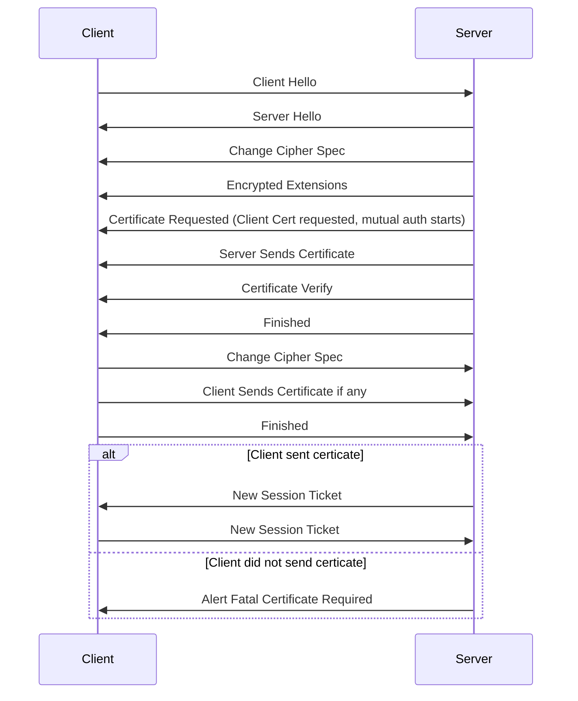

# TLS 1.3 Handshake Protocol with mutual auth requested vs required.

```mermaid
sequenceDiagram
    participant Client
    participant Server

    Client->>Server: Client Hello
    Server->>Client: Server Hello
    Server->>Client: Change Cipher Spec
    Server->>Client: Encrypted Extensions
    Server->>Client: Certificate Requested (Client Cert requested, mutual auth starts)
    Server->>Client: Server Sends Certificate 
    Server->>Client: Certificate Verify
    Server->>Client: Finished
    Client->>Server: Change Cipher Spec
    Client->>Server: Client Sends Certificate if any
    Client->>Server: Finished
    alt Client sent certicate
      Server->>Client: New Session Ticket 
      Client->>Server: New Session Ticket 
    else Client did not send certicate
      Server->>Client: Alert Fatal Certificate Required 
    end

```

